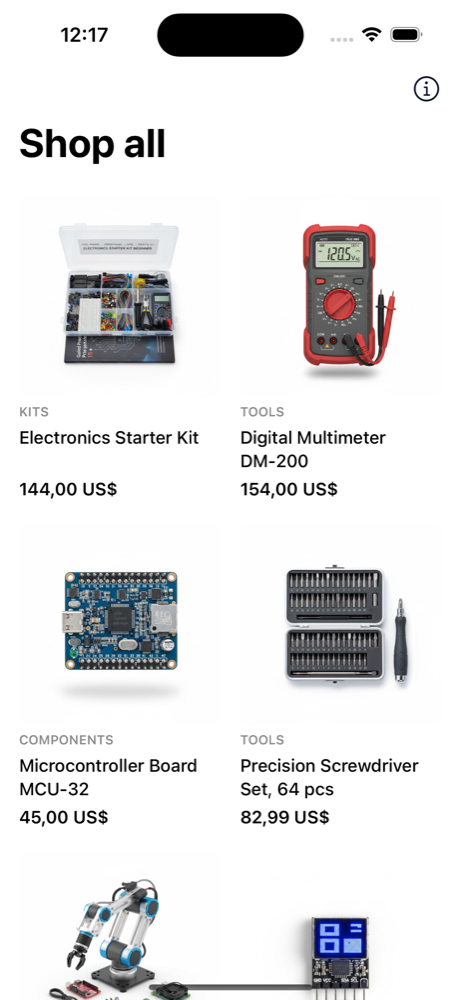
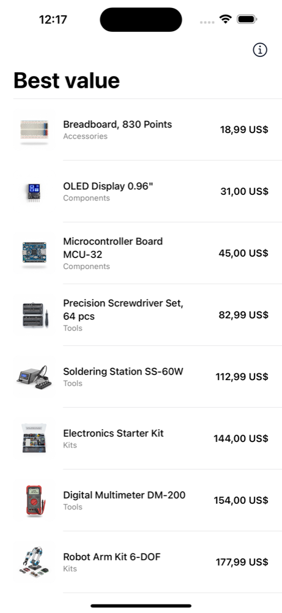
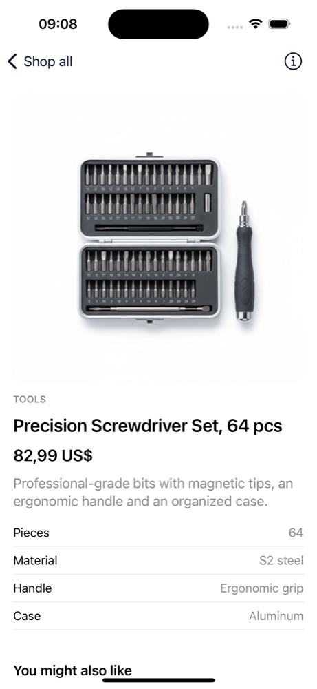
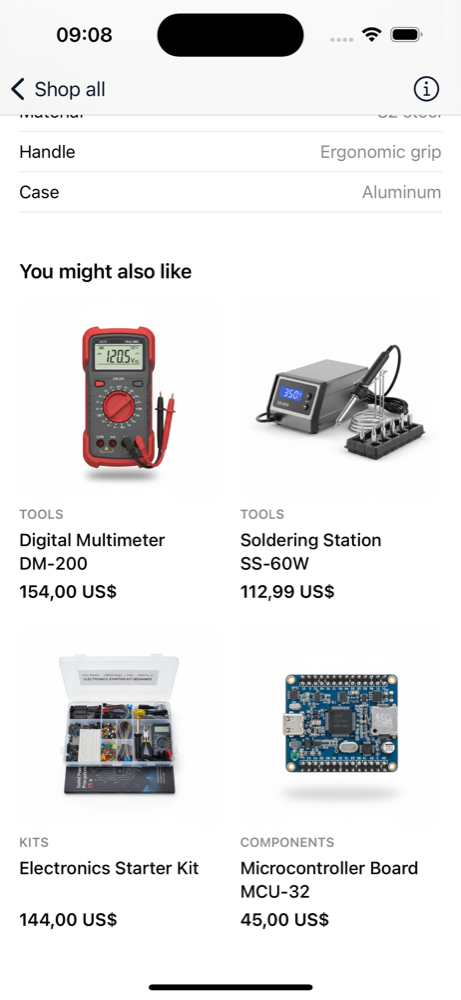

# Traffical iOS demo store

A small SwiftUI shop that shows how to add [Traffical](https://traffical.io) to an iOS app with the official [iOS SDK](https://github.com/traffical/ios-sdk). It has a catalog, product pages with recommendations below the fold, two running A/B tests, and the events that measure them.

| Catalog: grid | Catalog: list | Product page | Recommendations |
|---|---|---|---|
|  |  |  |  |

## Run it

Requires Xcode 15 or newer.

1. Open `HoldoutStore.xcodeproj`.
2. Pick an iPhone simulator and press **Run** (⌘R).

No setup is needed. The app is connected to a public demo project, and Xcode fetches the SDK through Swift Package Manager. Each simulator gets its own anonymous visitor id, so different simulators can land in different variants. Tap **ⓘ** on either screen to see which variant you got and the SDK's health counters, or tap **Become a new visitor** on the catalog to get a new id.

Click around and watch the Xcode console:

```
[Traffical] exposure for decision dec_…
[Traffical] track catalog_view ["layout": "grid", "sort": "featured", "product_count": 8, …]
[Traffical] track product_view ["product_id": "prod_001", "source": "catalog", "position": 4, …]
[Traffical] exposure for decision dec_…
[Traffical] track recommendation_impression ["product_id": "prod_005", "position": 1, "strategy": "same_category", …]
[Traffical] POST https://sdk.traffical.io/v1/events/batch → 200
```

The last line is the batch reaching Traffical. The demo sends a batch every 10 seconds, and whenever the app goes to the background.

## What runs in the demo project

| Experiment | Layer | Variants | Primary metric |
|---|---|---|---|
| `catalog-layout-test` | Catalog | **Grid**, featured order, "Shop all" (control)<br>**List**, sorted by price, "Best value" | Product page view rate |
| `recommendation-strategy-test` | Recommendations | **Same category** first (control)<br>**Similar price** range | Recommendation click rate |

Each experiment lives in its own layer, so a visitor is in both at once, independently.

| Event | When | Properties |
|---|---|---|
| `catalog_view` | The catalog is shown | `layout`, `sort`, `product_count`, `product_ids` |
| `product_view` | A product page is shown | `product_id`, `category`, `price`, `source` (`catalog` / `recommendation`), `position`, `source_product_id` |
| `recommendation_impression` | A recommended product scrolls into view | `product_id`, `source_product_id`, `position`, `strategy` |

The metrics built from these events are product page view rate, product page views per visitor, recommendation click rate, recommendation clicks per visitor, and recommendations seen per visitor. They're defined in [`.traffical/metrics.yaml`](.traffical/metrics.yaml).

## The integration, step by step

Everything Traffical-specific lives in [`Traffical.swift`](HoldoutStore/Traffical.swift), [`Events.swift`](HoldoutStore/Events.swift), and a few lines in the two screens.

**1. Create one client and start it.**

```swift
import Traffical

let traffical = TrafficalClient(options: .init(
    orgId: "org_…",
    projectId: "proj_…",
    env: "production",
    apiKey: "traffical_pk_…"      // publishable key, safe to ship in an app
))

// In your App's init:
Task { await traffical.initialize() }
```

`initialize()` never throws and never blocks your UI. Until the config arrives, the SDK serves the copy it cached on the last launch, or your defaults on a first launch.

The SDK never crashes or throws into your app. If it meets bad data, for example a malformed config or a non-finite number in an event, it falls back to your defaults and carries on. Pass `onError: { tag, error in … }` to hear about it, and call `traffical.getDiagnostics()` for running counts of errors, rejected configs and dropped events. The demo prints errors to the console and shows the counts in the ⓘ sheet.

**2. Declare the parameters a screen reads, with defaults.**

```swift
static let defaults: [String: TrafficalParameterValue] = [
    "pdp.recommendations.title": .string("You might also like"),
    "pdp.recommendations.strategy": .string("same_category"),
    "pdp.recommendations.count": .number(4),
]
```

Users see the defaults when no experiment is running, and when the app is offline before its first config download.

**3. Decide once per screen view.**

```swift
let decision = traffical.decide(defaults: RecommendationParams.defaults)
let strategy = decision.assignments["pdp.recommendations.strategy"]?.stringValue
```

One `decide` call resolves every parameter the screen asks for, on the device and with no network round trip. It also sends a **decision event**, which records that the visitor was assigned.

**4. Send an exposure when the change is actually seen.**

```swift
traffical.trackExposure(decision)
```

An exposure says the visitor saw what the experiment changed, and experiment analysis counts visitors from their first exposure. When that happens depends on where the change is:

- The catalog layout is visible as soon as the screen is, so [`CatalogView`](HoldoutStore/CatalogView.swift) sends the exposure right after deciding.
- The recommendations are below the fold. [`ProductDetailView`](HoldoutStore/ProductDetailView.swift) sends the exposure only when the first recommended product scrolls into view. A visitor who never scrolls down never saw the variant, so they shouldn't count toward it.

[`Viewport.swift`](HoldoutStore/Viewport.swift) is the small helper behind `.onEnterViewport { … }`: it runs once, when at least half of a view is on screen. `onAppear` is not enough here, because inside a `ScrollView` it can fire before anything is visible.

**5. Track what users do.**

```swift
traffical.track("product_view", properties: [
    "product_id": product.id,
    "source": "recommendation",
    "position": 2,
], options: .init(decisionId: decision.decisionId))
```

[`Events.swift`](HoldoutStore/Events.swift) keeps all of the app's events in one place, matching the definitions in `.traffical/config.yaml`. Passing the `decisionId` ties an event to the decision that shaped the screen it happened on.

### Who is the visitor?

Unless you say otherwise, the SDK creates an anonymous id and stores it in the Keychain, so a visitor keeps their variants across launches. Once you have your own user or device id, pass it in the context. The key is `userId` by default, and the project's settings can change it:

```swift
traffical.decide(context: ["userId": currentUser.id], defaults: RecommendationParams.defaults)
```

Use the same id your analytics uses, and don't switch ids when someone signs in. A visitor who changes ids mid-experiment can end up in both variants.

## Sending assignments to your own analytics instead

By default the SDK sends events to Traffical and you don't need anything else. If your team already has its own pipeline (Segment, RudderStack, Snowplow, a warehouse), the SDK can hand each assignment to your code instead. Set `disableCloudEvents: true` and add an `assignmentLogger`:

```swift
let traffical = TrafficalClient(options: .init(
    orgId: "org_…", projectId: "proj_…", env: "production", apiKey: "traffical_pk_…",
    disableCloudEvents: true,
    assignmentLogger: { entry in
        Analytics.shared.track("Experiment Assignment", properties: [
            "unit_key": entry.unitKey,
            "type": entry.type.rawValue,          // "decision" or "exposure"
            "policy_key": entry.policyKey ?? entry.policyId,
            "allocation_key": entry.allocationKey ?? entry.allocationName,
            "decision_id": entry.decisionId ?? "",
        ])
    }
))
```

The closure runs for decisions and exposures, once per experiment the visitor is in, and is deduplicated per session. Log the stable `policy_key` and `allocation_key`, not the opaque ids, so assignments join to your metrics. With cloud events off, `traffical.track(...)` sends nothing, so send your product events through your own analytics too.

## Use your own Traffical project

Parameters, events and metrics are config-as-code in [`.traffical/`](.traffical) and are synced with the [Traffical CLI](https://www.npmjs.com/package/@traffical/cli):

```bash
npm install -g @traffical/cli
traffical login
traffical init       # pick or create a project; writes .traffical/
traffical push       # creates the parameters, events and metrics
```

Then, in the Traffical dashboard:

1. Create a **Catalog** layer and move the `catalog.*` parameters into it. Create a **Recommendations** layer and move the `pdp.recommendations.*` parameters into it.
2. Add an A/B policy to each layer with the variants from the table above, attach its metrics, and start it.
3. Create a publishable key (**Settings → API Keys**), and put it with your org and project ids into `Traffical.swift`.

## What this demo leaves out

There's no cart or checkout, so no purchase event. In a real shop, add one where the order succeeds, with the order total as the value:

```swift
traffical.track("purchase", properties: ["order_id": order.id], options: .init(value: order.total))
```

The SDK also has typed getters, such as `traffical.string("catalog.title", default: "Shop all")`, that decide and send an exposure in one call. They're convenient for things that are visible the moment they're read. This demo uses `decide` plus an explicit `trackExposure` so the exposure can wait for the recommendations to scroll into view.

## Project layout

```
HoldoutStore/
  HoldoutStoreApp.swift      App entry, starts the SDK
  Traffical.swift            Client setup + parameter defaults
  Events.swift               Every event the app sends
  CatalogView.swift          Catalog screen: decide, expose, catalog_view
  ProductDetailView.swift    Product page: decide, product_view, recommendations
  Viewport.swift             onEnterViewport helper for below-the-fold exposure
  DecisionDetailsView.swift  The ⓘ sheet: unit key, decision id, variant, SDK health
  Product.swift              Static product data + recommendation strategies
.traffical/
  config.yaml                Parameters and events (config-as-code)
  metrics.yaml               Metrics built from the events
  project.yaml               Link to the Traffical project
```

No dependencies besides the Traffical SDK. The product photos come from Traffical's web demo store, *The Holdout*.

## License

MIT
